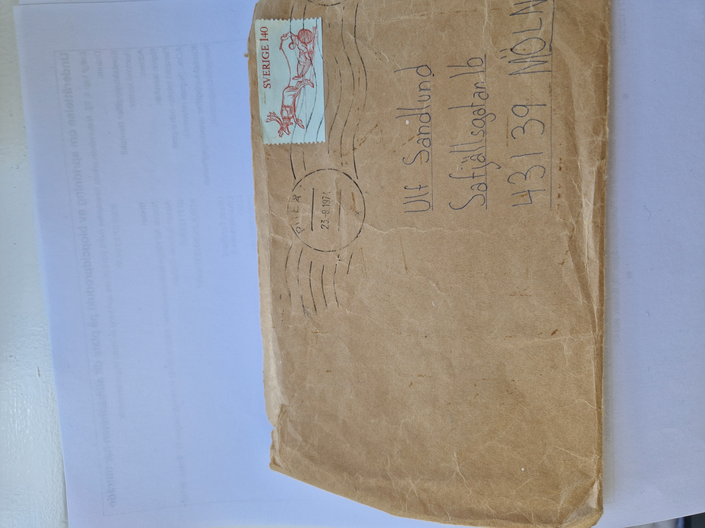
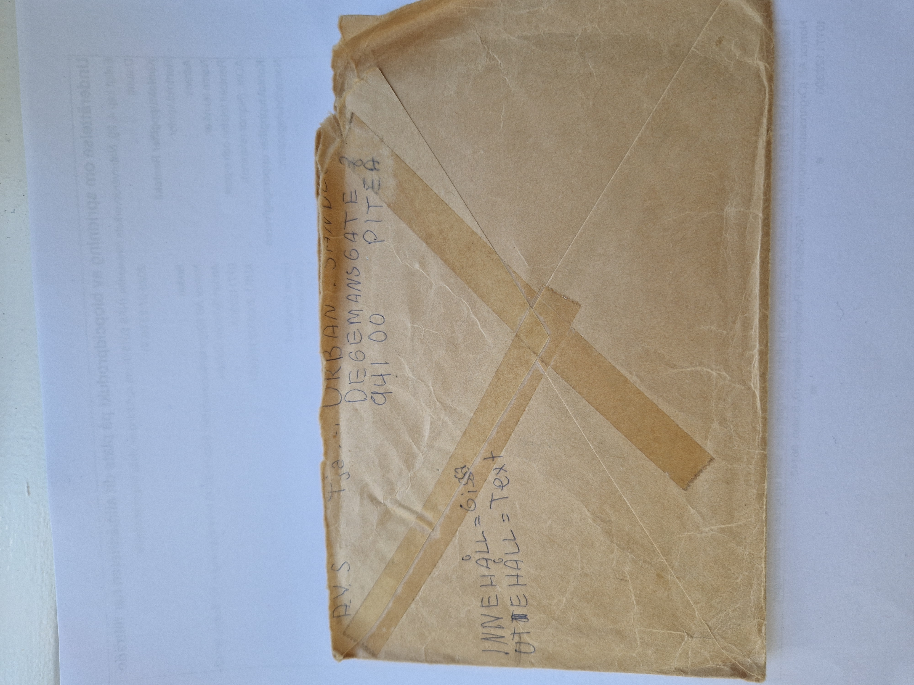
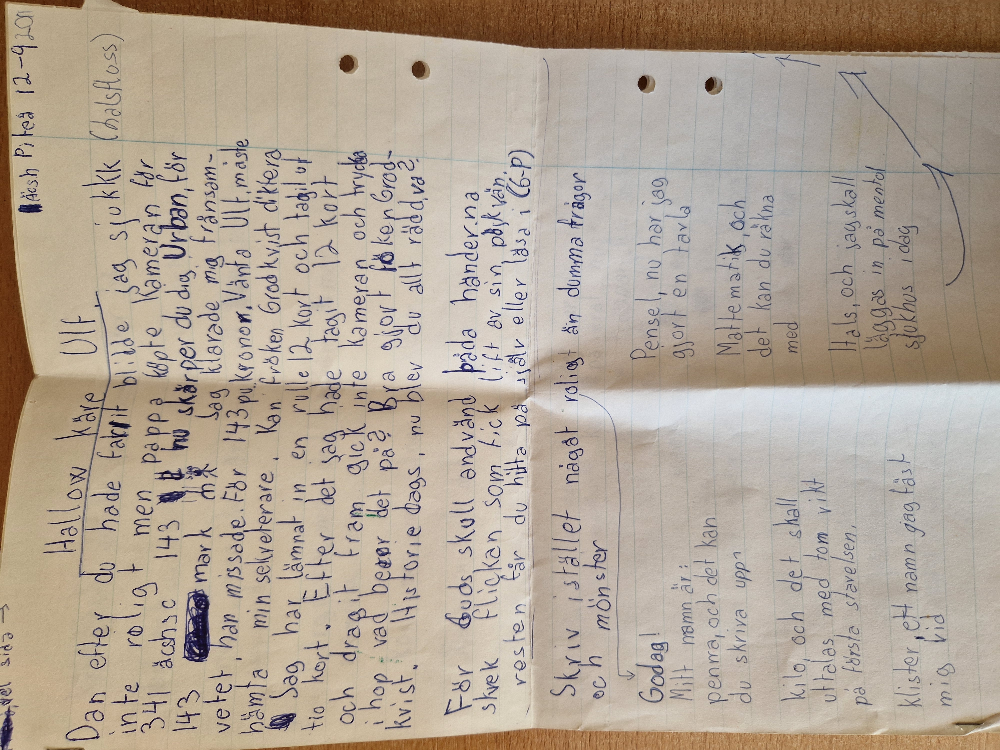
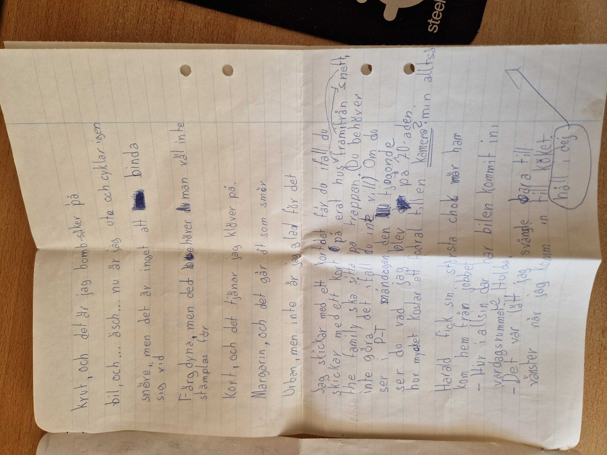
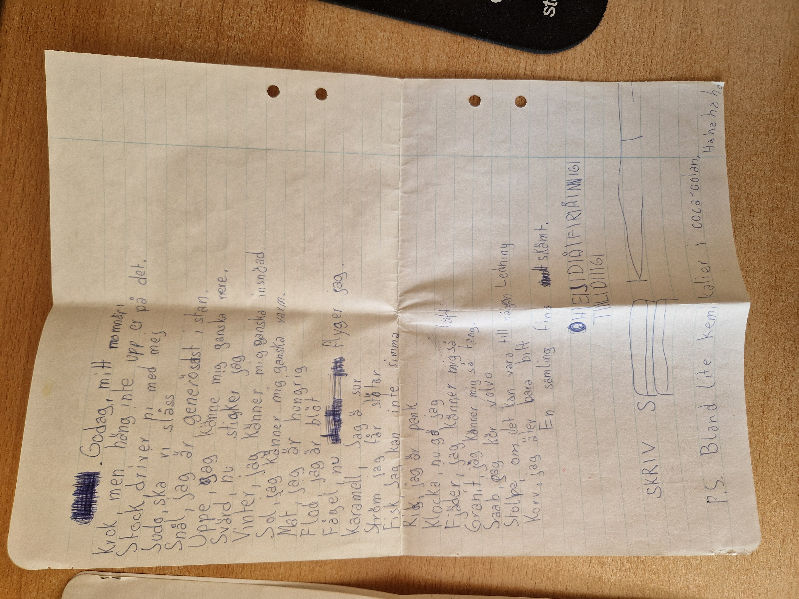
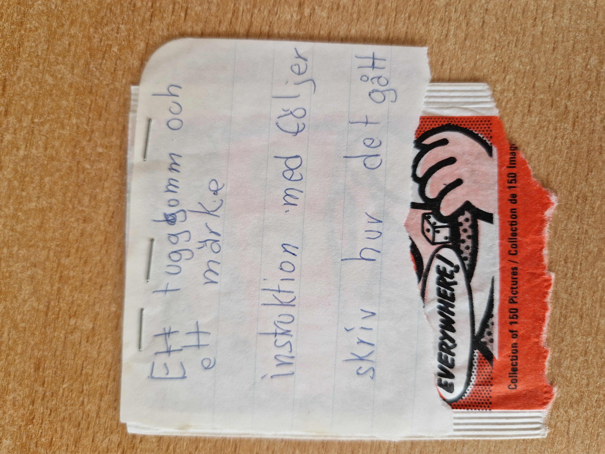
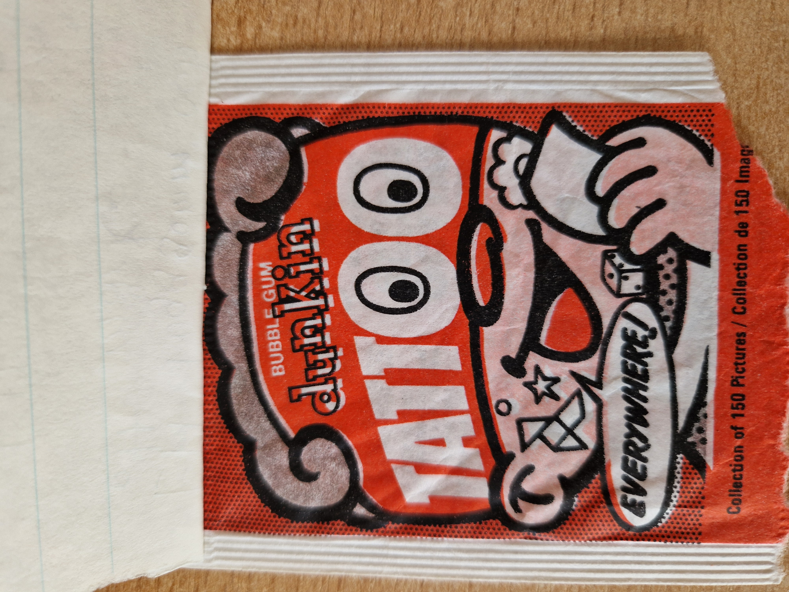
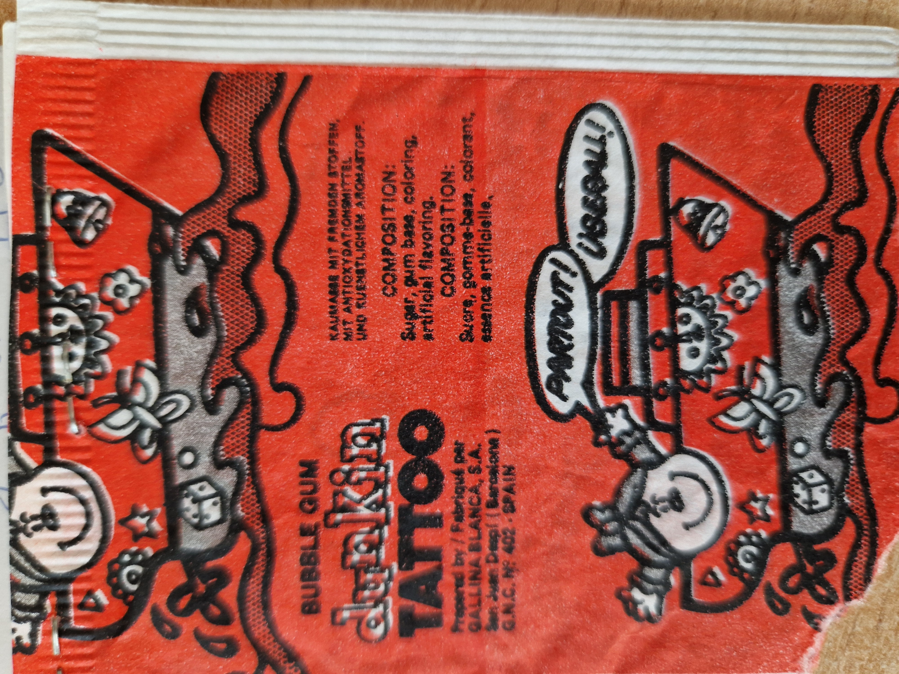

# Brev 1974-08-23

## Metadata

- **Poststämpel:** 1974-08-23
- **Plats:** Piteå
- **Avsändare:** Urban Sandlund
- **Mottagare:** Ulf Sandlund
- **Omfattning:** 3 handskrivna sidor
- **Bilagor:** 3
- **Kommentar:** Kuvertet är poststämplat 1974-08-23 men brevet innehåller datumet "Äsch Piteå 12-9-??". Det är därför möjligt att innehåll och kuvert inte hör ihop. Tills vidare används poststämpeln som brevets datum.

---

# Envelope Front

## Bild

## Beskrivning

Brunt kuvert adresserat för hand till:

> Ulf Sandlund  
> Safjällsgatan 16  
> 431 39 Mölndal

Frankerat med ett svenskt 140-öres frimärke och poststämplat **Piteå 23-8-1974**.

---

# Envelope Back

## Bild

## Beskrivning

Kuvertets baksida är försluten med tejp.

Avsändaradress:

> Urban Sandlund  
> Degemansgate 3  
> 941 00 Piteå

Övriga handskrivna texter:

> A.V.S.

(A.V.S. = Avsändare.)

> Tja...

> 3.

> INNEHÅLL = Gissa

> UTEHÅLL = Text

---

# Page 1

## Bild

## Transkription

Hej (Hallow) käre Ulf,

Äsch Piteå 12-9-??

Dan efter du hade farit blidde jag sjukkk (halsfluss). Inte roligt men pappa köpte kameran för 341... äsch... 143 mark.

$ Nu skärper du dig, Urban!

Jag klarade mig frånsamvetet, han missade. För 143 kr.

Vänta Ulf, måste hämta min sekreterare.

Kan fröken Grodkvist diktera.

Jag har lämnat in en rulle 12 kort och tagit tio kort. Efter det jag hade tagit 12 kort och dragit fram gick inte kameran att trycka ihop. Vad beror det på?

Bra gjort fröken Grodkvist.

Historiedags. Nu blev du allt rädd, va?

"För Guds skull använd båda händerna", skrek flickan som fick lift av sin pojkvän.

Resten får du hitta på själv eller läsa i (G-P).

Skriv istället något roligt än dumma frågor och mönster.

Goddag!

Mitt namn är:

Penna, och det kan du skriva upp.

Pensel, nu har jag gjort en tavla.

Matematik, och det kan du räkna med.

Hals, och jag skall läggas in på mentalsjukhus idag.

---

# Page 2

## Bild

## Transkription

krut, och det är jag bombsäker på.

bil, och... äsch... nu är jag ute och cyklar igen.

snöre, men det är inget att binda sig vid.

Färgdyna, men det behöver man väl inte stämplas för.

Kort, och det tjänar jag klöver på.

Margarin, och det går åt som smör.

Urban, men inte är jag glad för det.

Jag skickar med ett kort. Det får du ifall du skickar med ett kort på erat hus framifrån. "The family" ska sitta på trappan. (Du behöver inte göra det ifall du inte vill.)

Om du ser i P-T måndagen den tjogonde ser du vad jag blev på 70-aden. Hur mycket kostar ett fodral till en kamera? Min alltså.

Harald fick sin största chock när han kom hem från jobbet.

– Hur i allsin dar har bilen kommit in i vardagsrummet, Hulda!?

– Det var lätt. Jag svängde bara till vänster när jag kom in till köket.

(håll i dej)

---

# Page 3

## Bild

## Transkription

Goddag, mitt namn är

Krok, men häng inte upp er på det.

Stock, driver ni med mej.

Sudo, ska vi slåss.

Snål, jag är generösast i stan.

Uppe, jag känner mig ganska nere.

Svärd, nu sticker jag.

Vinter, jag känner mig ganska insnöad.

Sol, jag känner mig ganska varm.

Mat, jag är hungrig.

Flod, jag är blöt.

Fågel, nu flyger jag.

Karamell, jag är sur.

Ström, jag får stötar.

Fisk, jag kan inte simma.

Krig, jag är pank.

Klocka, nu går jag.

Fjäder, jag känner mig så lätt.

Granit, jag känner mig så tung.

Saab, jag kör Volvo.

Stolpe, om det kan vara till någon ledning.

Korv, jag äter bara biff.

En samling fina skämt.

OHEJDIÅFRAMIG  
TILLDIG

SKRIV SAKT-  
A

P.S. Blanda lite kemikalier i coca-colan.

Hahahaha

---

# Attachments

## Attachment 1

### Bild

### Beskrivning

Framsidan av en förpackning till **Dunkin Tattoo Bubble Gum**.

Förpackningen innehåller ett tuggummi och en tillfällig tatuering ("tattoo").

---

## Attachment 2

### Bild

### Transkription

Ett tugggumm och  
ett märke

instruktion med följer

skriv hur det gått

---

## Attachment 3

### Bild

### Beskrivning

Baksidan av samma tuggummiförpackning.

Visar produktinformation samt texten **"Everywhere!"** och att serien omfattar **150 bilder**.

---

# Sammanfattning

Detta är ett av de tidigaste breven i samlingen och Urban är omkring tolv år gammal. Brevet består nästan helt av ordvitsar, skämt och språklekar. Inledningsvis berättar han att han haft halsfluss och att familjen köpt en kamera, men därefter övergår brevet snabbt till en lång rad humoristiska infall.

Större delen av brevet bygger på dubbeltydiga uttryck och ordassociationer, exempelvis "nu är jag ute och cyklar igen", "det tjänar jag klöver på" och "det är inget att binda sig vid". Brevet avslutas med ytterligare ordvitsar, ett grafiskt skämt där ordet "SAKTA" delas mellan två rader samt en skämtsam uppmaning om Coca-Cola.

Till brevet följer dessutom tre bilagor: en förpackning till ett tuggummi med tillhörande tatuering, en handskriven instruktion samt den andra sidan av förpackningen. Bilagorna visar att brevet inte bara var ett brev utan också ett litet paket med en överraskning till kusinen Ulf.
