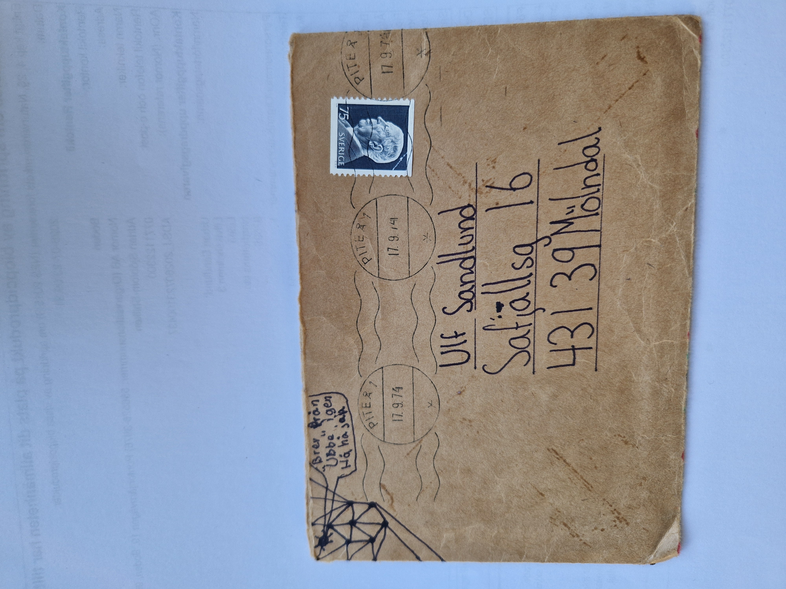
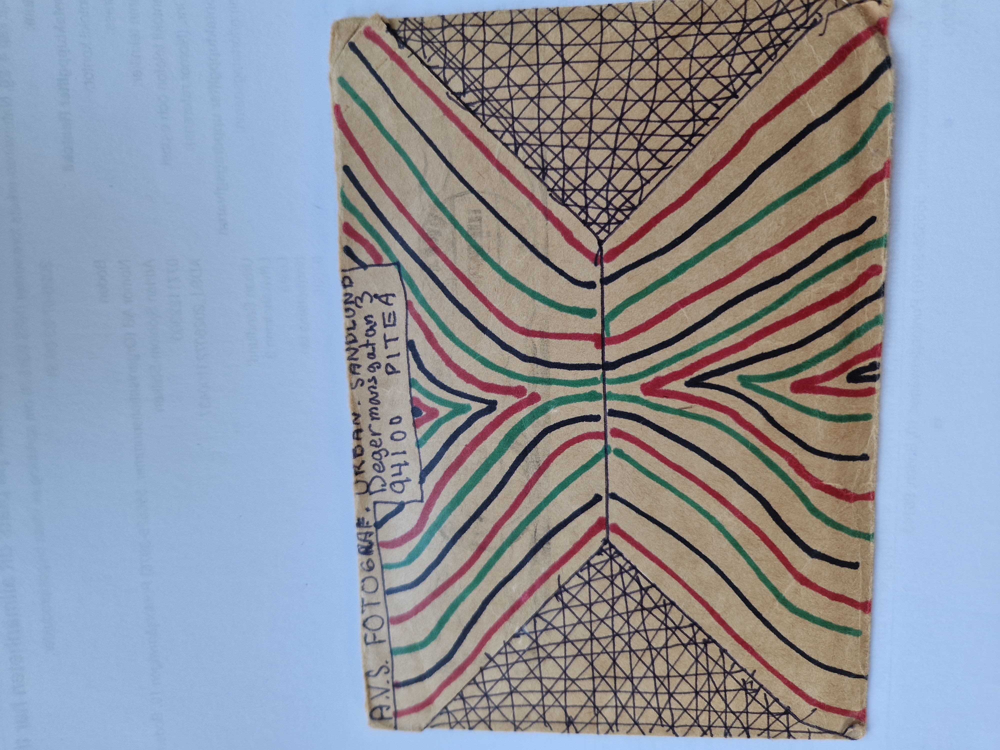
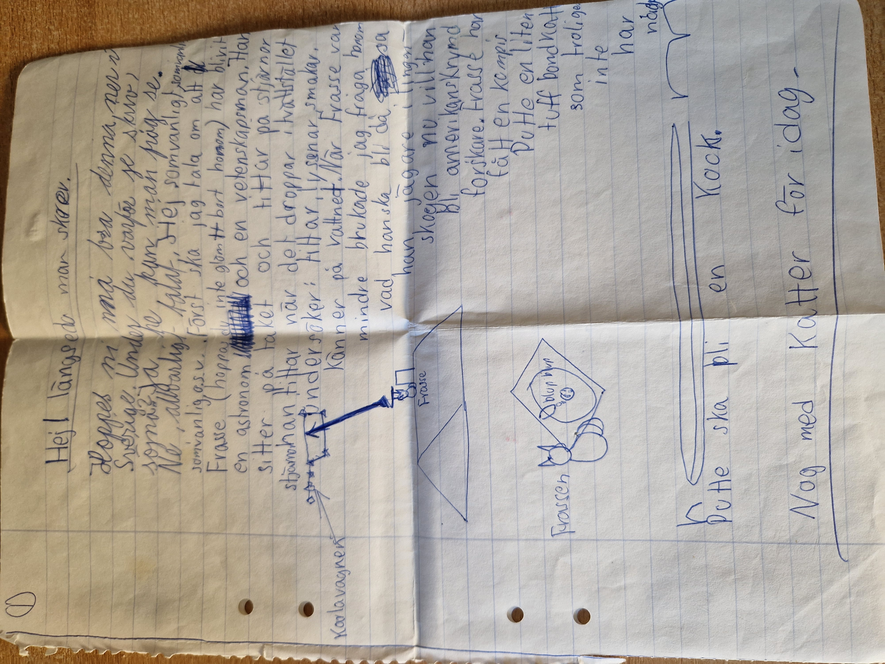
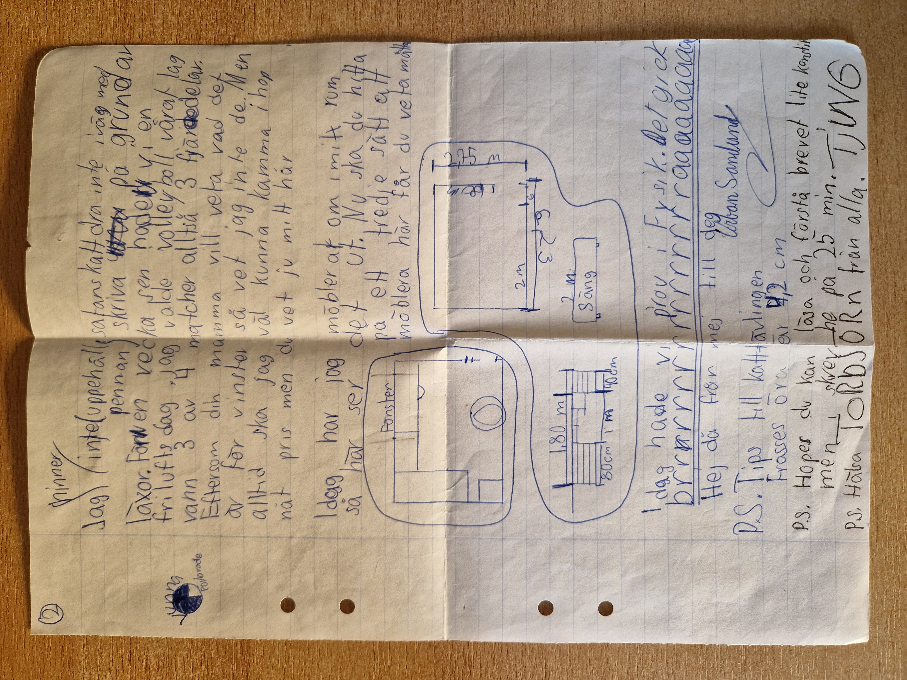

# Brev till Ulf

## Datum

**Poststämplat:** 1974-09-17

## Sammanfattning

Detta brev är skrivet den 17 september 1974 och präglas av Urbans karakteristiska blandning av humor, fantasi och vardagsberättelser.

Brevet inleds med ett skämtsamt försök att skriva på pitemål innan Urban övergår till vanlig svenska. Den största delen handlar om familjens katt Frasse, som beskrivs som en blivande astronom och vetenskapsman. Med hjälp av teckningar berättar Urban hur Frasse sitter på taket och studerar stjärnhimlen, undersöker världen genom att titta, lyssna, smaka och känna på vatten samt har fått en ny kattkompis, Putte.

I den andra delen berättar Urban om skolans friluftsdag där hans volleybollag vann tre av fyra matcher. Han visar även med ritningar hur han möblerat om sitt rum och utmanar Ulf att hitta ett tredje sätt att placera möblerna. Brevet avslutas med kommentarer om ett fysikprov, flera humoristiska post scriptum och en hälsning till Torbjörn.

Breven visar tydligt hur Urban vid tolv års ålder gärna blandade berättelser, ordvitsar, dialekt, illustrationer och små uppgifter till mottagaren för att göra breven underhållande.

---

## Kuvert

### Framsida

**Mottagare**

Ulf Sandlund  
Safjällsgatan 16  
431 39 Mölndal

**Poststämpel**

Piteå 1974-09-17

**Övrigt**

- Tecknat spindelnät i övre vänstra hörnet.
- Pratbubbla med text:

> Brev från "Ubbe" igen  
> Håhå jaja

---

### Baksida

**Avsändare**

A.V.S. FOTOGRAF.

Urban Sandlund  
Degermansgatan 3  
941 00 PITEÅ

**Övrigt**

Kuvertets baksida är rikt dekorerad med färgade linjer och geometriska mönster.

---

## Page 01

### Transkription

Hej! längeeda man skrev.

Hoppes ni må bra denja, ner i
Sverige. Under du varför je skriv
söjna? Ja he, kan man fråg se.

Ne, allvarlig(t) talat. Hej som vanligt,
som vanligt, o.s.v. Först ska jag tala om att
Frasse (hoppas du inte glömt bort honom) har blivit
en astronom och en vetenskapsman. Han
sitter på taket och tittar på stjärnor.
Han tittar när det droppar i tvättstället.
Undersöker: tittar, lyssnar, smakar,
känner på vattnet. När Frasse var
mindre brukade jag fråga honom
vad han ska bli då, sa
han, jägare i Lingon-
skogen. Nu vill han
bli amerikansk rymd-
forskare. Frasse har
fått en kompis.
Putte, en liten
tuff bondkatt
som troligen
inte har
något
hem.

Putte ska bli en Kock.

Nog med Katter för idag.

### Illustrationer på sidan

- Karlavagnen.
- Frasse på taket som tittar mot Karlavagnen.
- Teckning av Frasse bredvid ett tvättställ med droppande "blup blup".
- Putte.

---

## Page 02

### Transkription

Jag hinner
inte (uppehåll, satans katt dra inte iväg
pennan) skriva på grund av
läxor. För en vecka sen hade vi en
friluftsdag, jag valde volleyboll. Vårat lag
vann 3 av 4 matcher alltså 3 fjärdedelar.
Eftersom din mamma vill veta vad det
är för vinster så vet jag inte de. Men
alltid ska jag väl kunna kamma ihop
nåt pris men du vet ju mitt hår.

Idag har jag möblerat om i mitt rum
så här ser det ut. Nu ska du hitta
på ett tredje sätt att
möblera. Här får du veta måtten.

**(Tre skisser över rummet med mått.)**

- Rum: ca 2,3 × 2,75 m
- Säng: 2 m
- Fönster markerat
- Skiss med sängens mått: 1,80 m
  (80 cm + 1 m + 40 cm)

Idag hade vi prov i Fysik. Det gick
brrrrrrrrrrrrrrrrrrrrrraaaaaaaaa.

Hej då från mej till dej.

Urban Sandlund

P.S. Tips till katt-tävlingen.
Frasses öra är 4,2 cm.

P.S. Hoppes du kan
läsa och förstå brevet lite konstigt
men i skrev he på 25 min.

P.S. Hälsa TORBJÖRN från alla.

TJING

### Illustrationer på sidan

- Cirkel som visar att laget vann tre fjärdedelar av sina matcher (75 % markerat, en fjärdedel omarkerad).
- Tre skisser som visar hur rummet möblerats, med mått och ett uppdrag till Ulf att hitta ett tredje sätt att möblera.