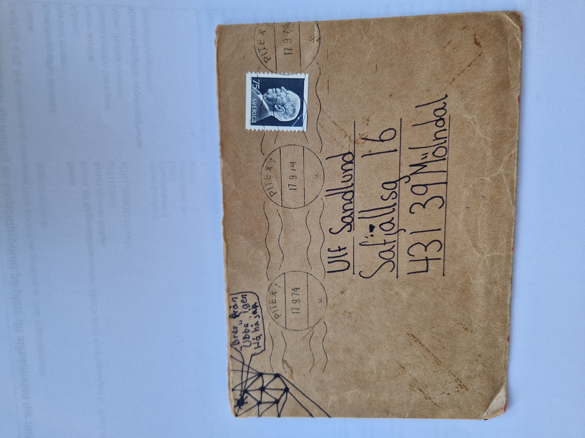
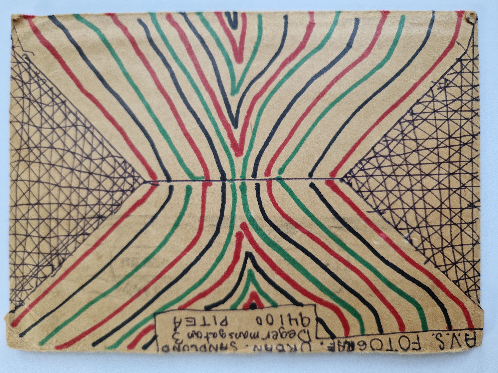
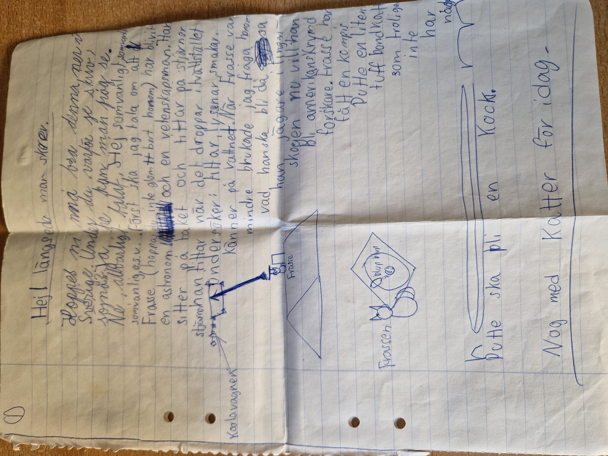
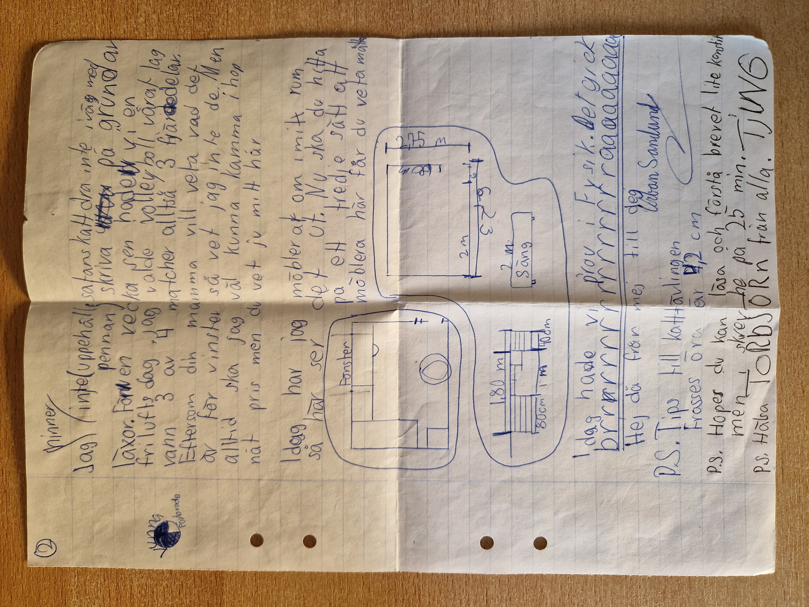

# Metadata

Poststämplat: 1974-09-17
Typ: Brev
Avsändare: Urban Sandlund
Mottagare: Ulf Sandlund
Urbans ålder: 11 år
Skrivtyp: handwritten

# Kuvert

## Framsida

**Mottagare**

Ulf Sandlund  
Safjällsgatan 16  
431 39 Mölndal

**Poststämpel**

Piteå 1974-09-17

**Övrigt**

- Tecknat spindelnät i övre vänstra hörnet.
- Pratbubbla med text:

> Brev från "Ubbe" igen  
> Håhå jaja

---

## Baksida

**Avsändare**

A.V.S. FOTOGRAF.

Urban Sandlund  
Degermansgatan 3  
941 00 PITEÅ

**Övrigt**

Kuvertets baksida är rikt dekorerad med färgade linjer och geometriska mönster.

---

# Letter

## Page 1

### Transcription

Hej! längeeda man skrev.

Hoppes ni må bra denja, ner i Sverige.
Under du varför je skriv söjna? Ja he, kan man fråg se.

Ne, allvarlig(t) talat. Hej som vanligt, som vanligt, o.s.v.
Först ska jag tala om att Frasse (hoppas du inte glömt bort honom)
har blivit en astronom och en vetenskapsman.
Han sitter på taket och tittar på stjärnor. Han tittar när det
droppar i tvättstället.
Undersöker: tittar, lyssnar, smakar, känner på vattnet.
När Frasse var mindre brukade jag fråga honom vad han ska bli
då, sa han, jägare i Lingon-skogen. Nu vill han bli amerikansk rymd-forskare.
Frasse har fått en kompis. Putte, en liten tuff bondkatt som troligen
inte har något hem. Putte ska bli en Kock.

Nog med Katter för idag.

### Description

Illustrationer på sidan:

- Karlavagnen.
- Frasse på taket som tittar mot Karlavagnen.
- Teckning av Frasse bredvid ett tvättställ med droppande "blup blup".
- Putte.

---

## Page 2

### Transcription

Jag hinner inte (uppehåll, satans katt dra inte iväg pennan) skriva på grund av
läxor. För en vecka sen hade vi en friluftsdag, jag valde volleyboll. Vårat lag
vann 3 av 4 matcher alltså 3 fjärdedelar.

Eftersom din mamma vill veta vad det är för vinster så vet jag inte de.
Men alltid ska jag väl kunna kamma ihop nåt pris men du vet ju mitt hår.

Idag har jag möblerat om i mitt rum så här ser det ut. Nu ska du hitta
på ett tredje sätt att möblera. Här får du veta måtten.

**(Tre skisser över rummet med mått.)**

- Rum: ca 2,3 × 2,75 m
- Säng: 2 m
- Fönster markerat
- Skiss med sängens mått: 1,80 m
  (80 cm + 1 m + 40 cm)

Idag hade vi prov i Fysik. Det gick
brrrrrrrrrrrrrrrrrrrrrraaaaaaaaa.

Hej då från mej till dej.

Urban Sandlund

P.S. Tips till katt-tävlingen. Frasses öra är 4,2 cm.

P.S. Hoppes du kan läsa och förstå brevet lite konstigt
men i skrev he på 25 min.

P.S. Hälsa TORBJÖRN från alla.

TJING

### Description

Illustrationer på sidan:

- Cirkel som visar att laget vann tre fjärdedelar av sina matcher (75 % markerat, en fjärdedel omarkerad).
- Tre skisser som visar hur rummet möblerats, med mått och ett uppdrag till Ulf att hitta ett tredje sätt att möblera.

# Attachments

# Sammanfattning

Urban berättar framför allt om katten Frasse, som i brevet får rollen som astronom och vetenskapsman, och om hans nye kattkompis Putte. Han skriver också om en friluftsdag med volleyboll, ommöbleringen av sitt rum och ett fysikprov. Brevet är lekfullt och rikt illustrerat, med skämt, dialekt och små uppgifter riktade till Ulf.

# Iakttagelser

- Frasse får en tydlig personlighet och en egen fantasivärld: från tidigare planer på att bli ”jägare i Lingon-skogen” till att nu vilja bli amerikansk rymdforskare.
- Text och teckningar samspelar genom hela brevet, bland annat med Frasse på taket, Karlavagnen, volleybollresultatet och skisserna över Urbans rum.
- Urban gör Ulf delaktig i brevet genom att be honom hitta ett tredje sätt att möblera rummet och genom tipset om Frasses öronmått till en ”katt-tävling”.
- Brevet är skrivet snabbt och spontant; Urban uppger själv att det tog 25 minuter och kommenterar samtidigt läxor och katten som försöker dra iväg pennan.
- Inledningen på pitemål, ordlekarna och de många post scriptum-delarna ger brevet en tydligt lekfull form.

# Personer

- **Urban Sandlund** – brevets avsändare.
- **Ulf Sandlund** – brevets mottagare och Urbans kusin.
- **Torbjörn** – vän till Ulf som Urban ber honom hälsa till.

# Djur

- **Frasse** – familjens katt och en central figur i brevet, där Urban skämtsamt beskriver honom som astronom och vetenskapsman.
- **Putte** – en liten bondkatt som blivit kompis med Frasse och som Urban skriver troligen saknar hem.
