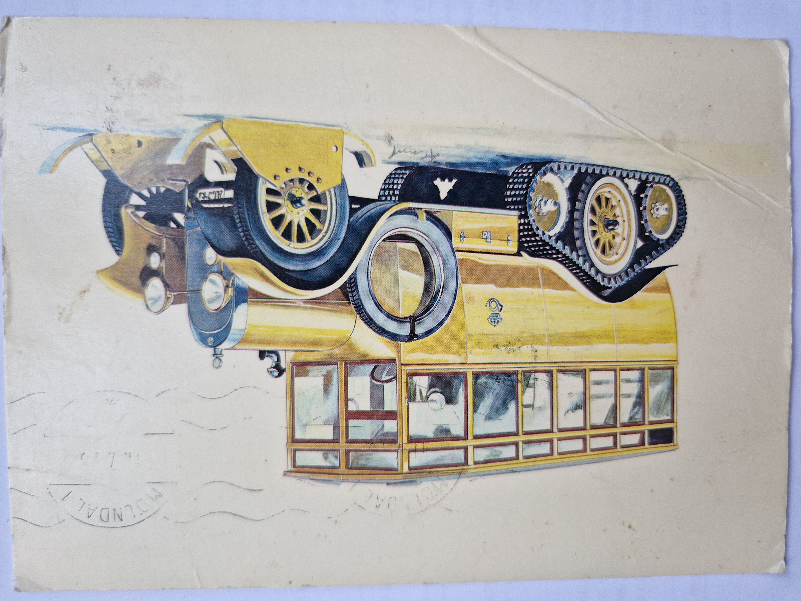
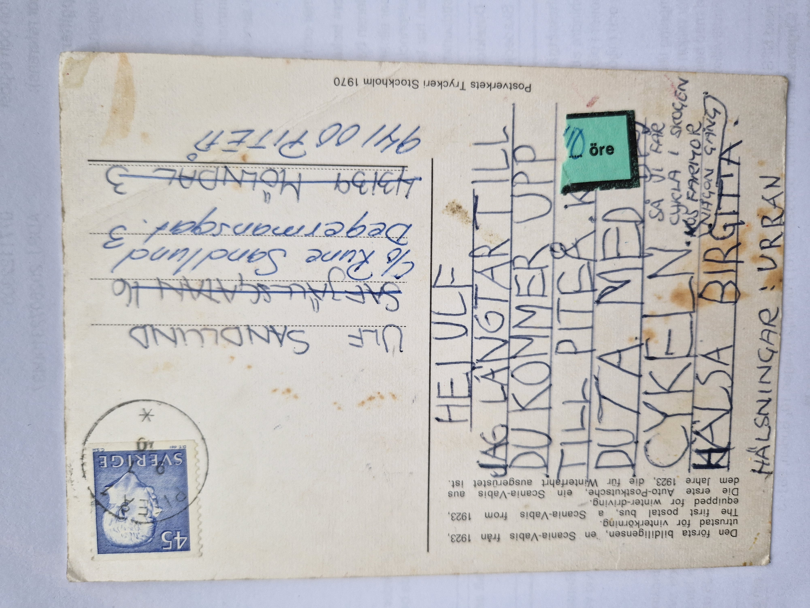

# Vykort till Ulf

## Framsida

### Motiv

Vykort med motiv av en äldre Scania-Vabis postbuss från 1923, utrustad för vinterkörning med banddrift och skidor.

På bildsidan finns en tydlig poststämpel:

**MÖLNDAL 1 – 1.7.75**

---

## Baksida

### Adress

Kortet var ursprungligen adresserat till:

Ulf Sandlund  
Safjällsgatan 16  
431 39 Mölndal

Den adressen har senare strukits över och ersatts med:

Ulf Sandlund  
c/o Rune Sandlund  
Degermansgatan 3  
941 00 Piteå

### Transkription

Hej Ulf

Jag längtar till
du kommer upp
till Piteå. Kan
du ta med dig
cykeln. Så att vi får
cykla i skogen
hos farmor någon gång.

Hälsa Birgitta.

Hälsningar: Urban

---

## Arkivanteckning

Vykortet verkar ha skickats till Ulf i Mölndal samtidigt som han var på väg till Piteå för sommaren. Den ursprungliga Mölndalsadressen är överstruken och kortet har fått en ny adress till c/o Rune Sandlund på Degermansgatan i Piteå.

En möjlig förklaring är att kortet hann fram till Mölndal efter att Ulf redan hade rest norrut och att hans familj därför skickade det vidare eller i retur så att det kunde nå honom i Piteå. Den exakta postgången går inte att fastställa, men kortet bär tydliga spår av att ha omdirigerats.

---

## Sammanfattning

Urban skriver att han längtar efter att Ulf ska komma upp till Piteå och ber honom ta med cykeln så att de kan cykla i skogen hos farmor. Vykortet är särskilt intressant eftersom den ursprungliga adressen i Mölndal har strukits och ersatts med familjen Sandlunds adress i Piteå. Det tyder på att kortet och Ulf korsade varandra på vägen norrut inför sommaren 1975.