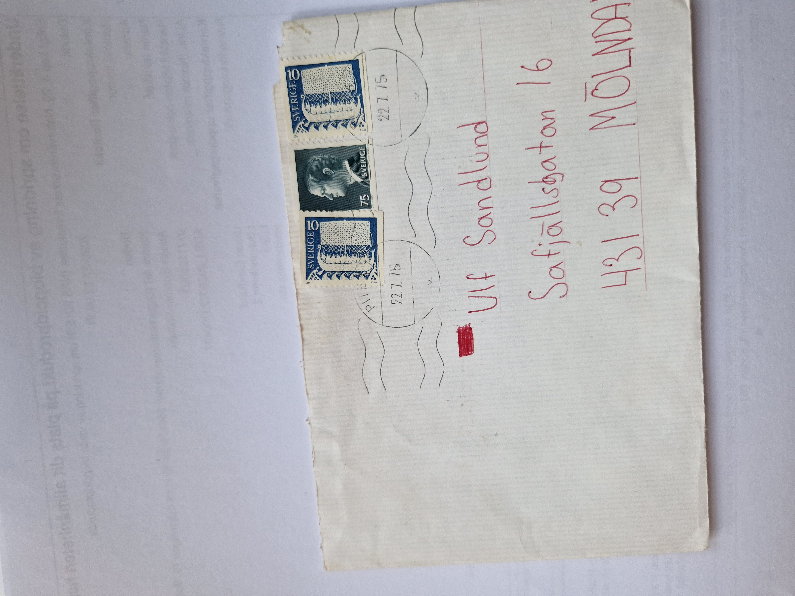
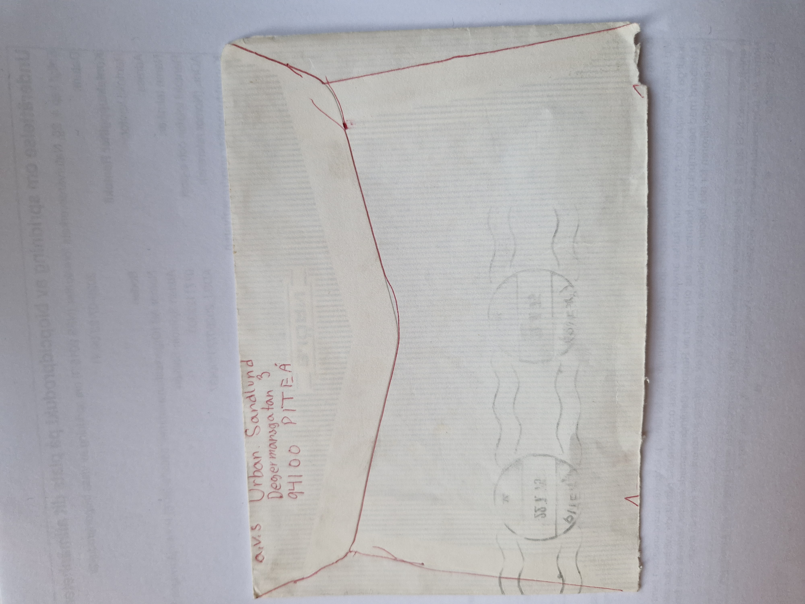
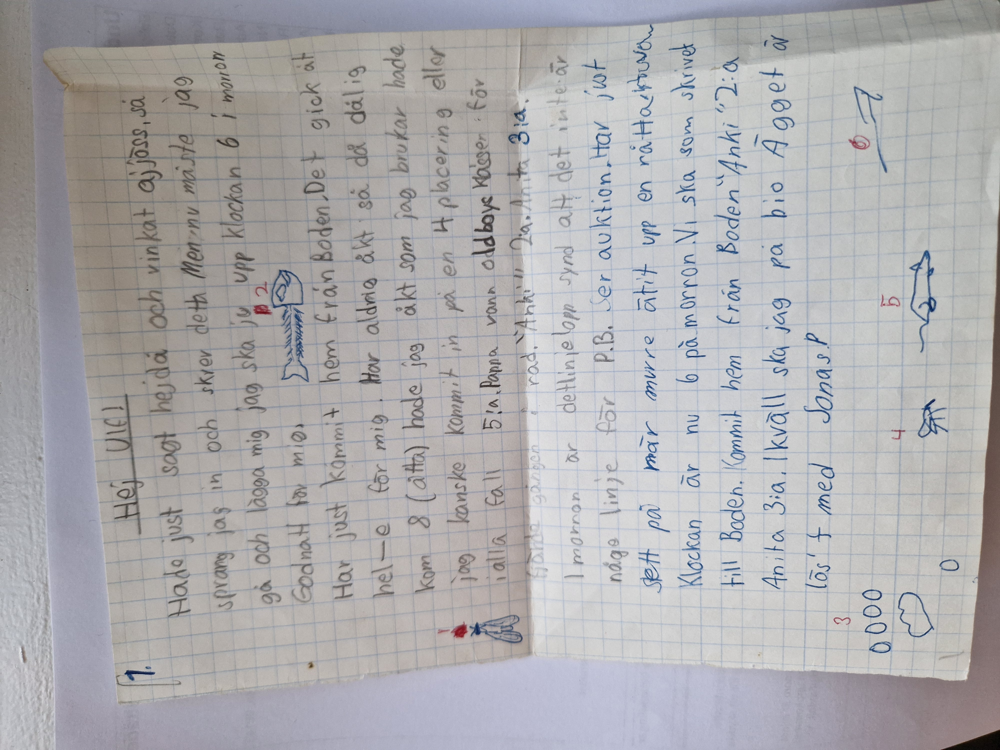
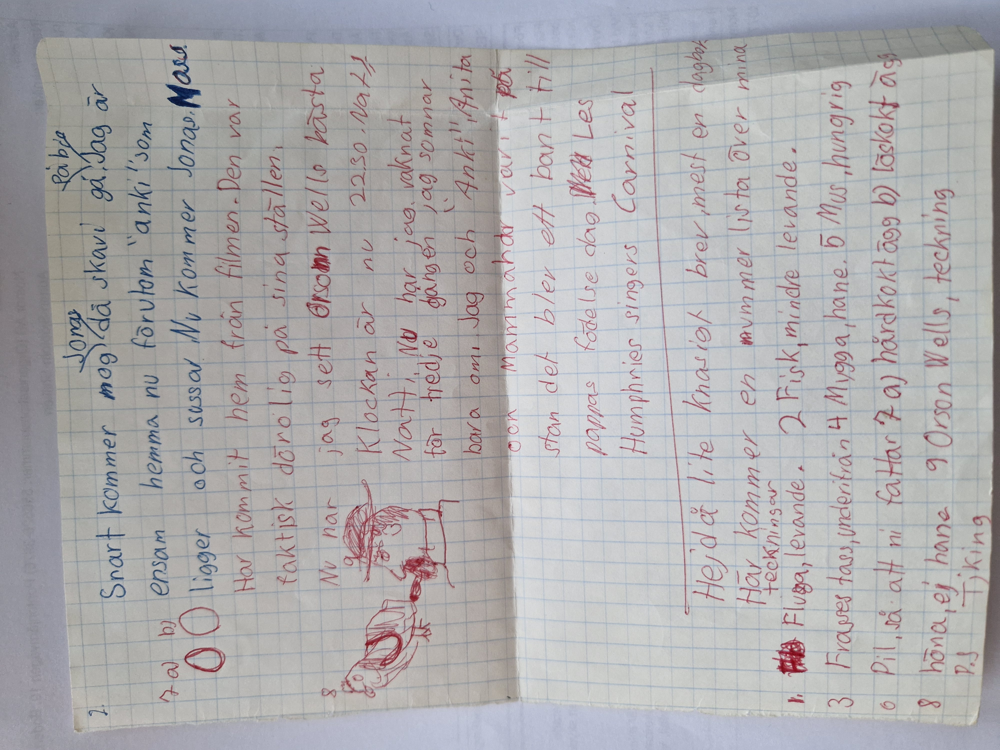

# 1975-07-22

## Datum

**Poststämpel:** 1975-07-22

## Sammanfattning

Ett vardagligt sommarbrev där Urban berättar om cykeltävlingar i Boden, familjens placeringar, planer för bio och vardagslivet hemma. Brevet är uppbyggt nästan som en dagbok där flera korta anteckningar skrivits vid olika tidpunkter under ett dygn. Det mest utmärkande är de numrerade små teckningarna som förklaras i slutet av brevet – ett lekfullt inslag som visar både humor och fantasi.

## Bilder

### Kuvert framsida

### Kuvert baksida

### Brevsida 1

### Brevsida 2

---

# Transkription

## Page 01

Hej Ulf!

Hade just sagt hejdå och vinkat adjöss, så
sprang jag in och skrev detta. Men nu måste jag
gå och lägga mig. Jag ska ju upp klockan 6 i morgon.

Godnatt för mig.

Har just kommit hem från Boden. Det gick åt
hel-e för mig. Har aldrig åkt så dåligt.
Kom 8 (åtta). Hade jag åkt som jag brukar hade
jag kanske kommit in på en 4 placering eller
i alla fall 5:a. Pappa vann oldboysklassen. För
fjärde gången i rad. "Anki" 2:a. Anita 3:a.

I morgon är det linjelopp. Synd att det inte är
något linje för P.B.

Ser auktion.

Har just
sett på när Murre ätit upp en råtta.

Klockan är nu 6 på morgon. Vi ska som skrivet
till Boden. Kommit hem från Boden. "Anki" 2:a.
Anita 3:a. I kväll ska jag på bio.
Ägget är löst med Jonas.

### Illustrationer på sidan

1. (Ingen teckning – förklaras på nästa sida som "Fluga, levande".)

2. Teckning av ett fiskskelett.

3. Fyra cirklar ovanför ett hjärtformat avtryck.

4. Teckning av en mygga.

5. Teckning av en mus.

6. Pil som visar att brevet fortsätter på nästa sida.

---

## Page 02

Snart kommer nog Jonas, då ska vi gå. Jag är
ensam hemma nu förutom "Anki" som
ligger och sussar. Nu kommer Jonas.

Har kommit hem från filmen. Den var
faktisk dörolig på sina ställen.

Nu har jag sett Orson Welles bästa.

Klockan är nu 22.30. Natt!
Natti, nu har jag vaknat
för tredje gången. Jag somnar
bara om. Jag och "Anki", Anita
och mamma har varit på
stan. Det blev ett band till
pappas födelsedag. Med Les
Humphries Singers Carnival.

Hejdå, lite knasigt brev, mest en dagbok.

Här kommer en nummerlista över mina
teckningar.

1. Fluga, levande.
2. Fisk, mindre levande.
3. Frasses tass, underifrån.
4. Mygga, hane.
5. Mus, hungrig.
6. Pil, så att ni fattar.
7 a) Hårdkokt ägg.
   b) Löskokt ägg.
8. Höna, ej hane.
9. Orson Wells, teckning.

P.S.
Tjing.

### Illustrationer på sidan

7a. Hårdkokt ägg.

7b. Löskokt ägg.

8. Höna.

9. Teckning av Orson Welles.