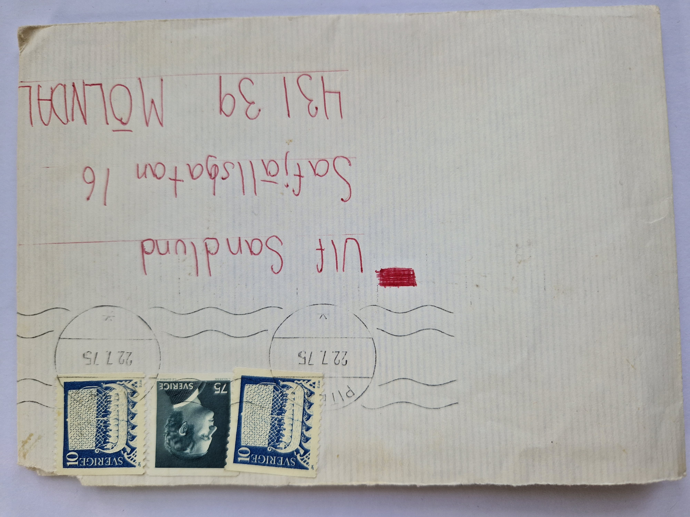
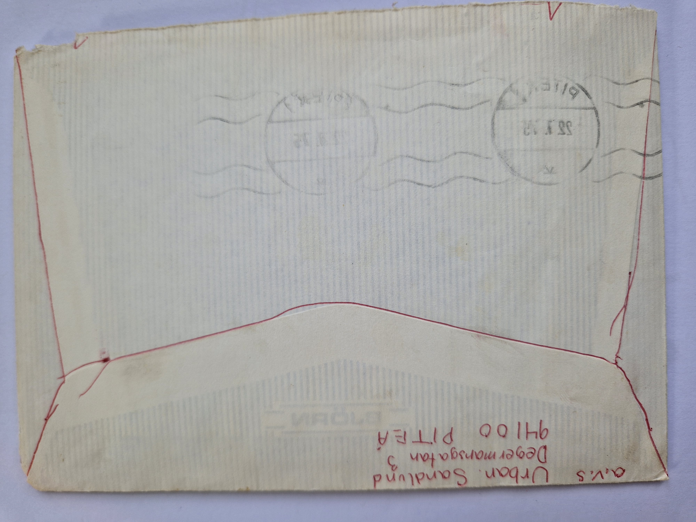
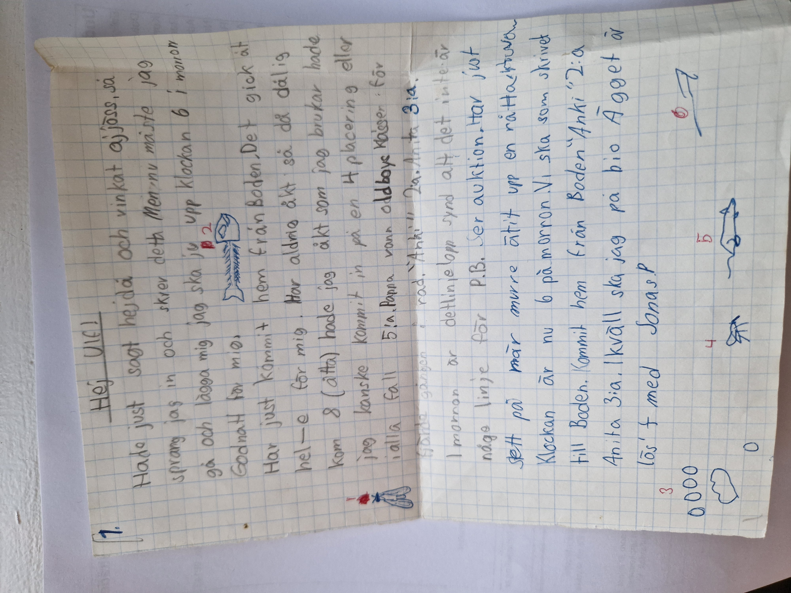
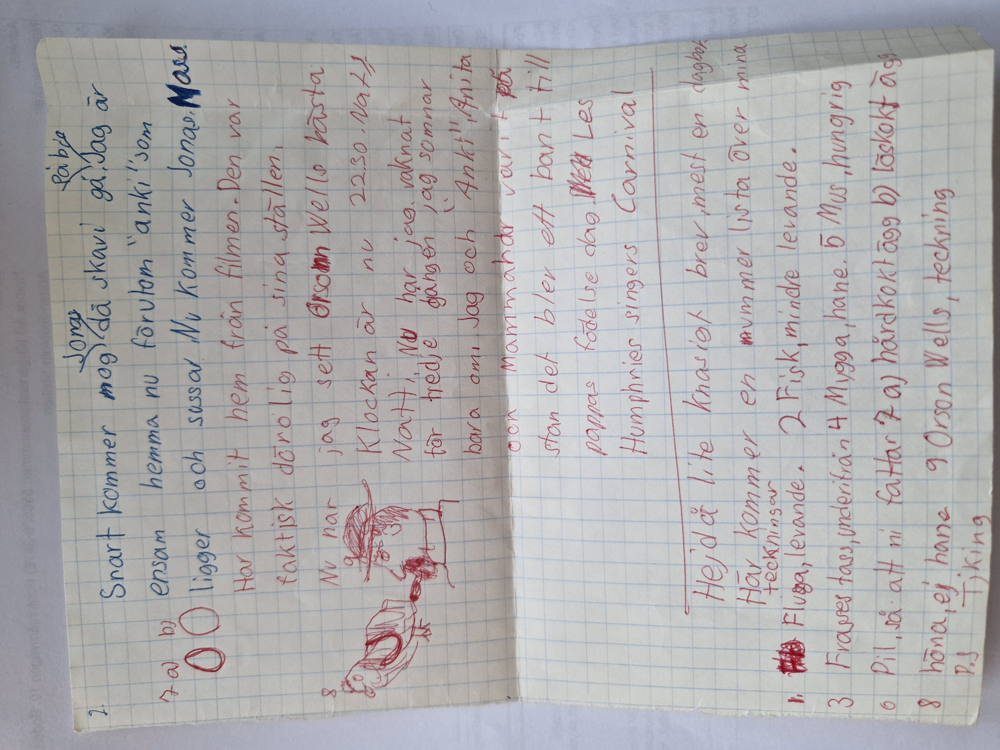

# Metadata

- Poststämplat: 1975-07-22
- Typ: Brev
- Skrivtyp: handwritten
- Avsändare: Urban Sandlund
- Mottagare: Ulf Sandlund
- Avsändarens ålder: 12 år

## Bilder

### Kuvert framsida



### Kuvert baksida



### Brevsida 1



### Brevsida 2




# Kuvert

## Framsida

Poststämpel: 1975-07-22

## Baksida

## Sida 1

### Transcription

```text
Hej Ulf!

Hade just sagt hejdå och vinkat adjöss, så sprang jag in och skrev detta. Men nu måste jag gå och lägga mig. Jag ska ju upp klockan 6 i morgon. Godnatt för mig.

Har just kommit hem från Boden. Det gick åt hel-e för mig. Har aldrig åkt så dåligt. Kom 8 (åtta). Hade jag åkt som jag brukar hade jag kanske kommit in på en 4 placering eller i alla fall 5:a. Pappa vann oldboysklassen. För fjärde gången i rad. "Anki" 2:a. Anita 3:a.
I morgon är det linjelopp. Synd att det inte är något linje för P.B.
Ser auktion.

Har just sett på när Murre ätit upp en råtta.

Klockan är nu 6 på morgon. Vi ska som skrivet till Boden. Kommit hem från Boden. "Anki" 2:a. Anita 3:a. I kväll ska jag på bio. Ägget är löst med Jonas.
```

### Description

1. (Ingen teckning – förklaras på nästa sida som "Fluga, levande".)

2. Teckning av ett fiskskelett.

3. Fyra cirklar ovanför ett hjärtformat avtryck.

4. Teckning av en mygga.

5. Teckning av en mus.

6. Pil som visar att brevet fortsätter på nästa sida.

## Sida 2

### Transcription

```text
Snart kommer nog Jonas, då ska vi gå. Jag är ensam hemma nu förutom "Anki" som ligger och sussar. Nu kommer Jonas.
Har kommit hem från filmen. Den var faktisk dörolig på sina ställen.
Nu har jag sett Orson Welles bästa.
Klockan är nu 22.30. Natt! 
Natti, nu har jag vaknat för tredje gången. Jag somnar bara om.

Jag och "Anki", Anita och mamma har varit på stan. Det blev ett band till pappas födelsedag. Med Les Humphries Singers Carnival.
Hejdå, lite knasigt brev, mest en dagbok.

Här kommer en nummerlista över mina teckningar.
1. Fluga, levande.
2. Fisk, mindre levande.
3. Frasses tass, underifrån.
4. Mygga, hane.
5. Mus, hungrig.
6. Pil, så att ni fattar.
7 a) Hårdkokt ägg.
   b) Löskokt ägg.
8. Höna, ej hane.
9. Orson Wells, teckning.
P.S.
Tjing.
```

### Description

7a. Hårdkokt ägg.
7b. Löskokt ägg.
8. Höna.
9. Teckning av Orson Welles.

# Bilagor

# Sammanfattning

Urban skriver ett sommarbrev i dagboksform med korta nedslag från cykeltävlingar, familjeliv och ett biobesök. Brevet får en lekfull prägel genom numrerade teckningar som förklaras på sista sidan.

# Iakttagelser

- Brevet växer fram genom korta anteckningar vid olika tidpunkter. Urban beskriver själv formen som ”mest en dagbok”.
- Numrerade teckningar på första sidan får sina förklaringar på den andra; läsaren behöver båda sidorna för att följa bildleken.
- Cykeltävlingar framträder som en del av familjens gemensamma vardag, med flera familjemedlemmar som deltagare.

# Personer

- Urban Sandlund – avsändare.
- Ulf Sandlund – mottagare och Urbans kusin.
- Rune Sandlund – Urbans pappa; deltar i cykeltävlingarna.
- Anki Sandlund – Urbans storasyster; nämns i cykeltävlingarna och hemma.
- Anita Sandlund – Urbans syster; nämns i cykelresultaten och stadsbesöket.
- Jonas – följer med Urban på bio; efternamn inte fastställt här.
- Orson Welles – nämns i samband med filmen.
- Barbro Sandlund – Urbans mamma; följer med på stan.

# Djur

- Murre – nämns när han äter en råtta; art och ägare är inte fastställda.
- Frasse – familjens katt; hans tass återges i en numrerad teckning.
