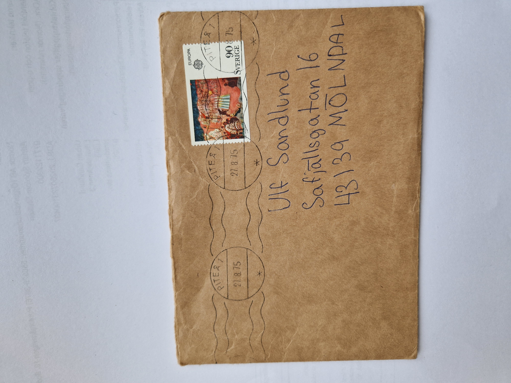
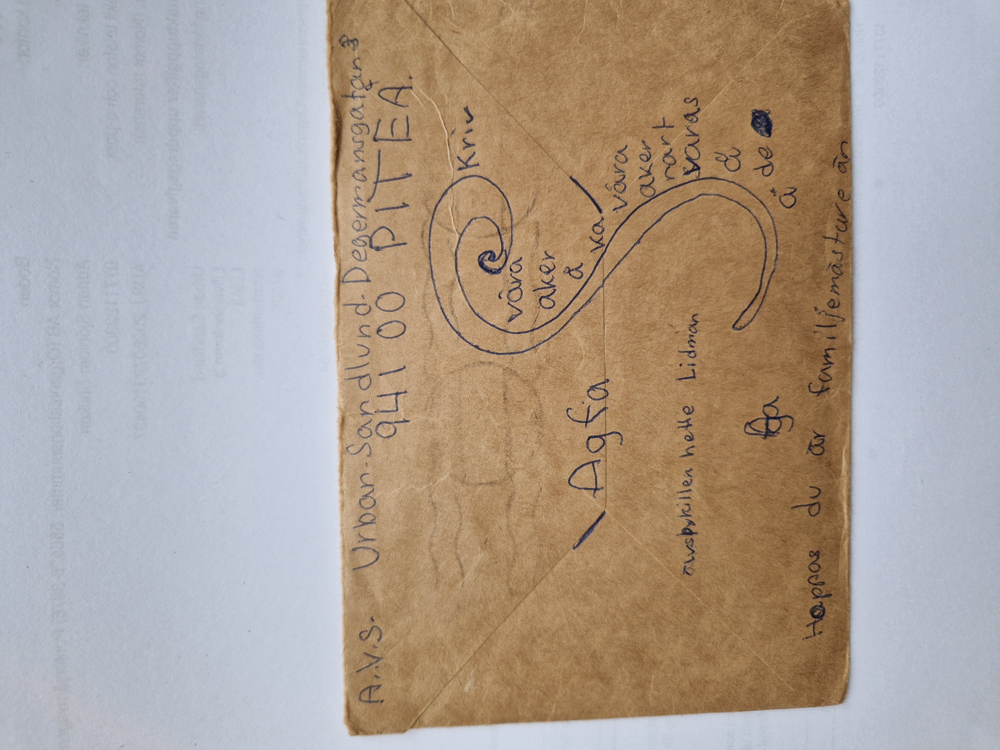
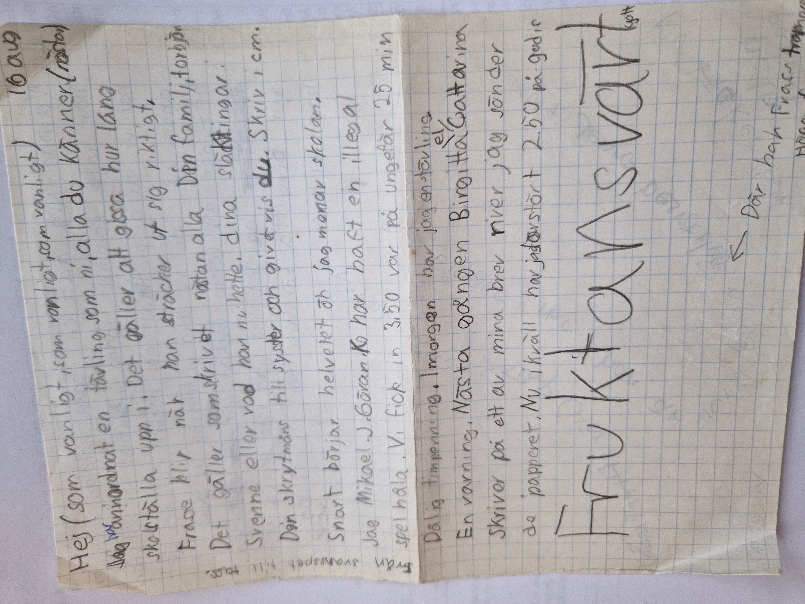
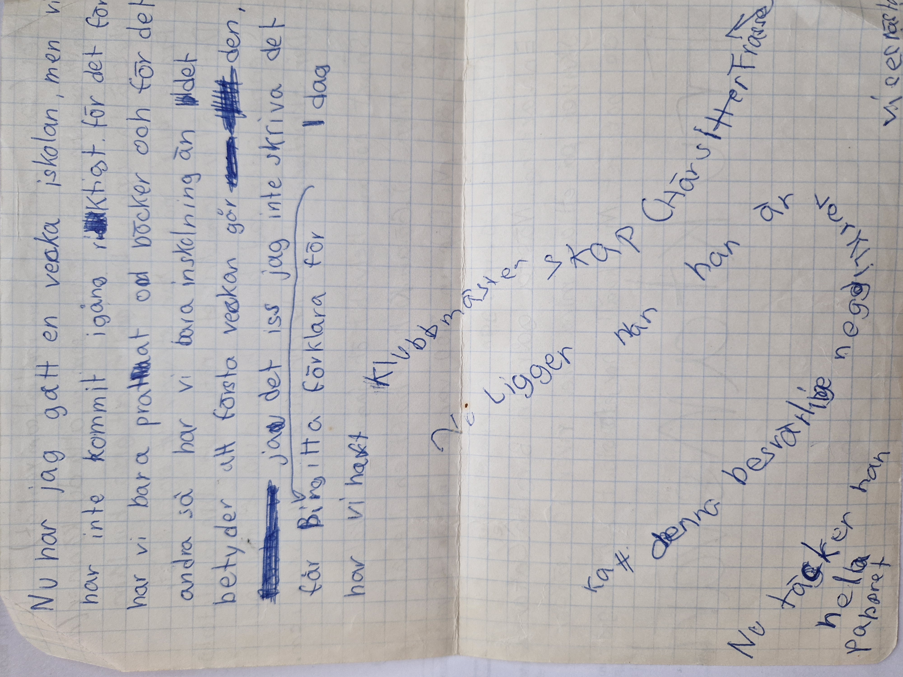
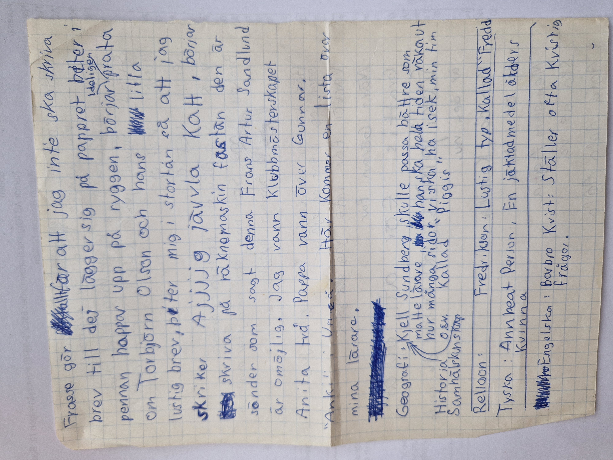
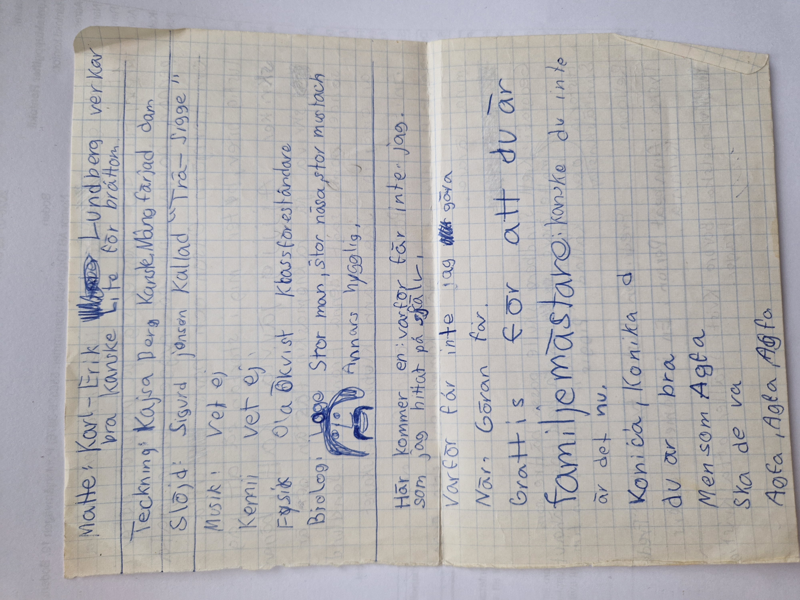

# Letter

**Datum:** 1975-08-27  
**Poststämpel:** 1975-08-27, Piteå  
**Typ:** Brev

## Kuvert

### Framsida

**Adressat:**

Ulf Sandlund  
Safjällsgatan 16  
431 39 MÖLNDAL

### Baksida

**Text:**

AVS. Urban Sandlund  
Degermansgatan 3  
941 00 PITEÅ

Agfa

Älvsbykillen hette Lidman.

Ett stort **S** med orden:

- vara
- åker
- å
- ka
- våren
- åker
- snart
- varas
- å
- de

(ordleken avslutas med texten **"Skriv"**)

Hoppas du är familjemästare än.

---

## Sida 1

### Transkription

Hej (som vanligt, som vanligt, som vanligt.)

Jag har anordnat en tävling som ni alla du känner (nästan)
ska ställa upp i. Det gäller att gissa hur lång
Frasse blir när han sträcker ut sig riktigt.
Det gäller som skrivet nästan alla. Din familj, Torbjörn,
Svenne eller vad han nu hette, dina släktingar.
Din skrytmåns till syster och givetvis du. Skriv i cm.

Snart börjar helvetet och jag menar skolan.
Jag, Mikael, J. Göran, K. har haft en illegal
spelhåla. Vi fick in 3,50 var på ungefär 25 min.

Dålig timpenning.

Imorgon har jag en tävling.

En varning. Nästa gången Birgitta eller Catarina
skriver på ett av mina brev river jag sönder
det pappret.

Nu ikväll har jag bara 2,50 på godis.

**Fruktansvärt.**

*(Pil: Där har Frasse trampat.)*

**Marginaltext:**

Från svansspets till tass.

---

## Sida 2

### Transkription

Nu har jag gått en vecka i skolan, men vi
har inte kommit igång riktigt. För det första
har vi bara pratat om böcker och för det
andra så har vi bara inskolning än. Det
betyder att första veckan går den,
det ids jag inte skriva, det får Birgitta förklara.

Idag har vi haft

*(Texten slingrar sig runt eftersom Frasse ligger på pappret.)*

Klubbmästerskap.

(Här sitter Frasse.)

Nu ligger han här, han är verkligen
besvärlig denna katt.

Nu täcker han
hela pappret.

---

## Sida 3

### Transkription

Frasse gör allt för att jag inte ska skriva
brev till dej. Lägger sig på pappret, biter i
pennan, hoppar upp på ryggen, börjar prata
om Torbjörn Olson och hans lustiga
brev, biter mig i stortån så att jag
skriker **Ajjjjg jävla katt**, börjar
skriva på räknemaskin fastän den är
sönder, som sagt denna Frans Artur Sandlund
är omöjlig.

Jag vann klubbmästerskapet.
Anita två. Pappa vann över Gunnar.
"Anki" i Umeå.

Här kommer en lista över
mina lärare.

**Geografi / Historia / Samhällskunskap:**

Kjell Sundberg. Skulle passa bättre som
mattelärare. Han ska hela tiden räkna ut
hur många sidor vi ska ha i sek, min tim.
O.s.v.
Kallad "Piggis".

**Religion:**

Fredr. Kvarn. Lustig typ. Kallad "Freddi".

**Tyska:**

Annbeat Person. En jäklad medelålders
kvinna.

**Engelska:**

Barbro Kvist. Ställer ofta kvistiga
frågor.

---

## Sida 4

### Transkription

**Matte:** Karl-Erik Lundberg verkar
bra. Kanske lite för bråttom.

**Teckning:** Kajsa Berg. Kanske. Mångfärjad dam.

**Slöjd:** Sigurd Jönsen. Kallad "Trä-Sigge".

**Musik:** Vet ej.

**Kemi:** Vet ej.

**Fysik:** Ola Ökvist. Klassföreståndare.

**Biologi:** Lage. Stor man, stor näsa, stor mustasch.
Annars hygglig.

*(Teckning av biologiläraren.)*

Här kommer en "Varför får inte jag...",
som jag hittat på själv.

Varför får inte jag göra
när Göran får.

Grattis för att du är
familjemästare!
Kanske du inte
är det nu.

Konica, Konika,
du är bra.

Men som Agfa
ska de va.

Agfa, Agfa, Agfa.

---

# Sammanfattning

Brevet skrevs bara en vecka efter skolstarten hösten 1975 och ger en levande bild av hur Urban upplevde övergången till en ny termin. Istället för att beskriva skolarbetet berättar han främst om människorna omkring sig – lärarna får humoristiska smeknamn och korta, träffsäkra personbeskrivningar som visar den unga brevskrivarens blick för detaljer och ordlekar.

Den röda tråden genom hela brevet är dock katten **Frasse**, som inte bara nämns utan aktivt blir en del av berättandet. Urban låter katten störa själva brevskrivandet: Frasse ligger på pappret, biter i pennan och i stortån, hoppar upp på ryggen och gör att texten bokstavligen måste slingra sig runt honom. Brevet blir därför både en berättelse om katten och ett exempel på hur den fysiska situationen påverkar hur brevet är skrivet. Denna lek med form och innehåll återkommer ofta i Urbans brev men är ovanligt tydlig här.

Brevet innehåller också flera återkommande teman i korrespondensen mellan kusinerna: en tävling där mottagaren och familjen ska gissa Frasses längd, små interna skämt om Birgitta och Catarina som skriver i Ulfs brev, rapporter från familjens klubbmästerskap och en lekfull rivalitet mellan kameramärkena **Agfa** och **Konica**. Även kuvertets baksida används kreativt med ordlekar och grafiska inslag.

Sammantaget framstår brevet mindre som ett traditionellt brev och mer som ett underhållande litet magasin, där berättelser, ordvitsar, illustrationer och personliga kommentarer vävs samman. Det visar tydligt hur viktigt det var för Urban att inte bara informera Ulf om vad som hänt, utan också att roa honom under läsningen.