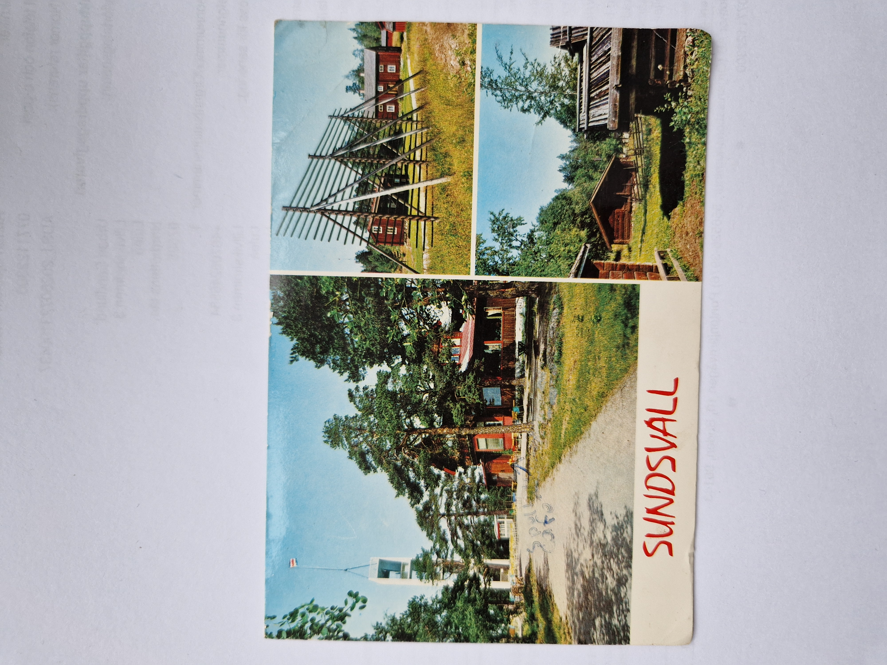
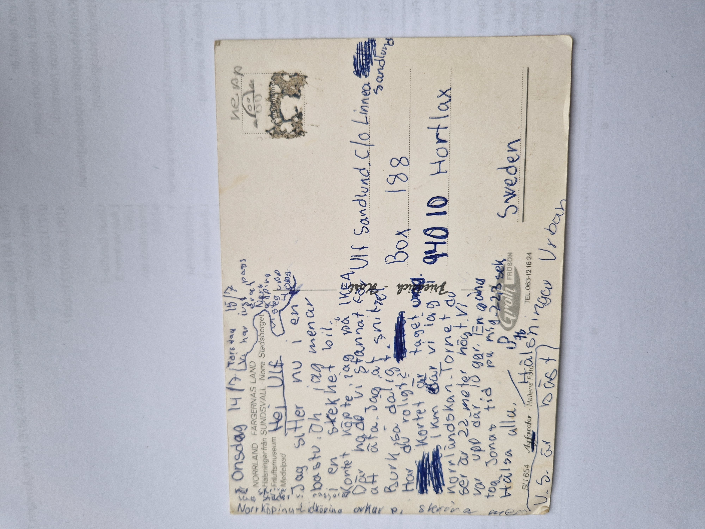

# 1976 – Vykort från Sundsvall

## Fakta

**Typ:** Vykort

**Datum:** 1976-07-14–15 (daterat i texten)

**Poststämpel:** Ej läsbar

**Avsändningsort:** Sundsvall

**Mottagare:**

Ulf Sandlund  
c/o Linnea Sandlund  
Box 188  
940 10 Hortlax  
Sweden

---

# Framsida

### Motiv

Flerbildsvykort från Sundsvall med motiv från Norra Berget. Vykortet visar bland annat utsiktstornet och byggnader från friluftsmuseet.

---

# Baksida

### Transkription

**Onsdag 14/7**

**Torsdag 15/7**

Vi har just passerat
Norrköping.
Vi steg upp kl. 4.

Hej Ulf

Jag sitter nu i en
bastu. Oh, jag menar
i en stekhet bil.

Kortet köpte jag på IKEA.
Där hade vi stannat för
att äta. Jag åt schnitzel.
Burk, så dåligt.

Har du roligt?

Kortet är taget ungefär
1 km där vi låg vid
Norrlandsokån. Tornet du
ser är 22 meter högt. Vi
var upp där också. En och
en halv minut tog
Jonas tid på mig.
22,3 sek.

Hälsa alla.

P.S.
U.S. är bäst.

Hälsningar

Urban

---

# Sammanfattning

Urban skickar ett vykort från Sundsvall under familjens semesterresa sommaren 1976. Han berättar att de just passerat Norrköping och att de gick upp redan klockan fyra på morgonen. När vykortet skrivs sitter han skämtsamt "i en bastu" innan han rättar sig och förklarar att det egentligen är en stekhet bil.

Familjen har stannat vid IKEA för att äta, där Urban åt schnitzel. Han beskriver även motivet på vykortet och berättar att utsiktstornet på Norra Berget är 22 meter högt samt att de varit uppe i det. Jonas tog tiden när Urban sprang upp, vilket enligt honom tog 22,3 sekunder.

Vykortet är adresserat till kusinen Ulf, som denna sommar bodde hos deras farmor Linnea i Hortlax. Det ger därför en liten inblick i familjens semestervanor och kusinernas kontakt under sommarlovet. Vykortet avslutas med en hälsning till alla och den humoristiska kommentaren "U.S. är bäst."