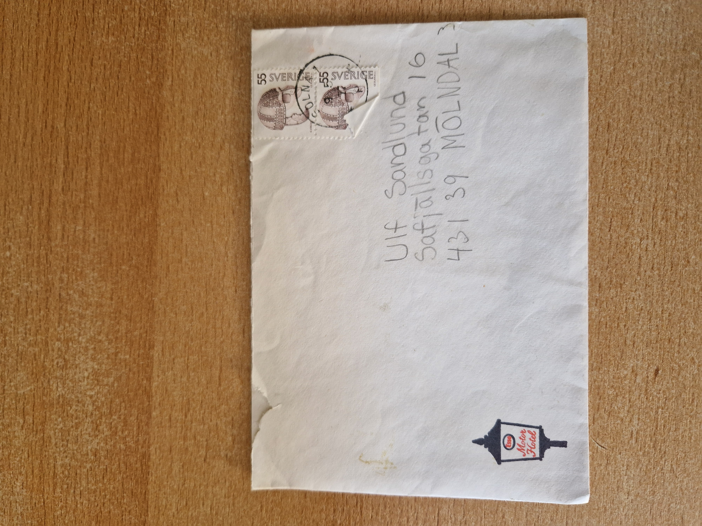
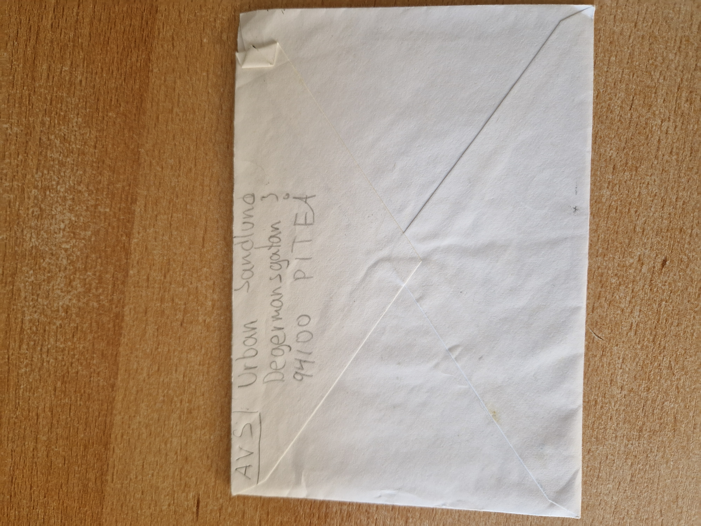
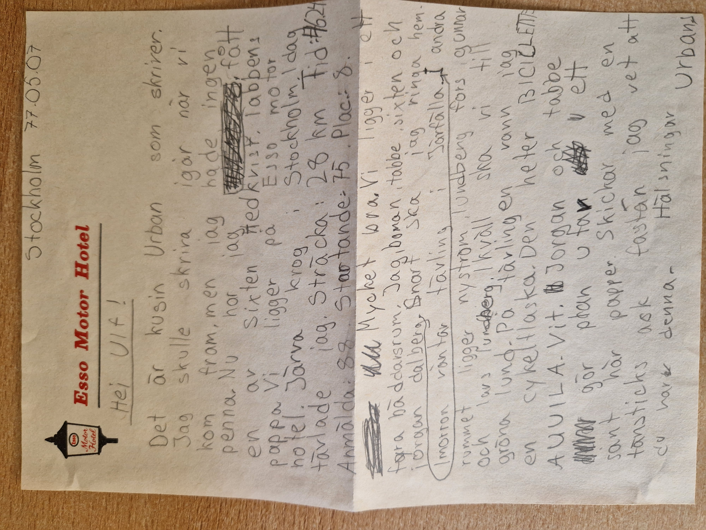

# 1977-05-07 – Stockholm (Esso Motor Hotel)

## Fakta

**Datum skrivet:** 1977-05-07

**Poststämpel:** 1977-05-09 (Solna)

**Plats:** Stockholm (Esso Motor Hotel, Järva Krog)

**Antal sidor:** 1

**Bilagor:** Tändsticksask (omnämnd i brevet)

---

## Kuvert

### Framsida

**Mottagare**

Ulf Sandlund  
Safjällsgatan 16  
431 39 Mölndal

**Poststämpel**

Solna 1977-05-09

**Frimärken**

Två svenska 55-öres frimärken.

**Övrigt**

Kuvert från Esso Motor Hotel.

### Baksida

**Avsändare**

A.V.S.

Urban Sandlund  
Degermansgatan 3  
941 00 Piteå

---

# Brevet

## Page 01

### Transkription

Stockholm 77.05.07

Hej Ulf!

Det är kusin Urban som skriver.
Jag skulle skriva igår när vi
kom fram, men jag hade ingen
penna. Nu har jag fått
en av Sixten Hedkvist, tabbens
pappa. Vi ligger på Esso Motor
Hotel. Järva Krog i Stockholm. Idag
tävlade jag. Sträcka: 28 km. Tid: 40.24.
Anmälda: 88. Startande: 75. Plac.: 8.

Mycket bra. Vi ligger i ett
fyrabäddarsrum. Jag, boman, tabbe, sixten och
jörgan dalberg. Snart ska
jag ringa hem.

Imorgon väntar tävling
i Järfälla. I andra
rummet ligger nyström,
lundberg, fors, gunnar
och Lars Lundberg.

Ikväll ska vi till
Gröna Lund. På tävlingen vann
jag en cykelflaska.

Jörgen och tabbe
gör pappersflygplan av
sånt här papper. Skickar med en
tändsticksask fastän jag vet att
du har denna.

Hälsningar

Urban

---

# Sammanfattning

Urban skriver brevet från Esso Motor Hotel vid Järva Krog i Stockholm under en tävlingshelg. Han berättar att han glömde skriva dagen innan eftersom han saknade penna, men har nu fått låna en av Sixten Hedkvist, tabbens pappa.

Han redovisar dagens cykeltävling med stor noggrannhet: sträckan var 28 kilometer, tiden 40.24 och han kom på åttonde plats bland 75 startande (88 anmälda). Som pris vann han en cykelflaska.

Urban berättar vilka som bor i hotellrummen, att de planerar att besöka Gröna Lund på kvällen och att nästa dags tävling ska köras i Järfälla. Han nämner flera cykelkamrater vid namn, bland andra boman, tabbe, sixten, nyström, lundberg, fors och gunnar.

Brevet avslutas med att Urban skickar med en tändsticksask och berättar att Jörgen och tabbe gör pappersflygplan av hotellets brevpapper.